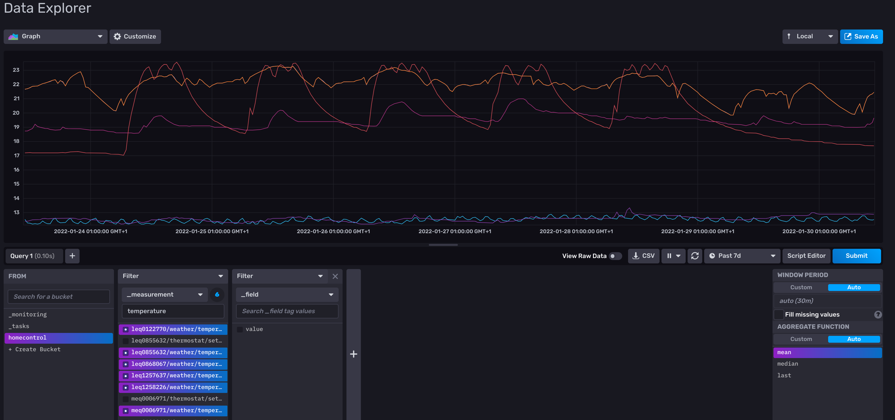

# homecontrol homie to influxdb logger
Logs property changes from mqtt homie property to an influxdb. This can be used to display timeseries charts of your data like a temperature chart.
Please note only influxdb versions >= 2.0 are supported.  

[](https://homieiot.github.io/)


__`hc-deconz2homie` is part of:__

[](https://github.com/homie-homecontrol) <span style="font-size:32px; font-weight: 700;">homie-homecontrol</span>  &nbsp;[link](https://github.com/homie-homecontrol)

# Table of contents
- Docker image
- Configuration 
  - Environment variables
    - General config
    - MQTT Broker config
    - InfluxDB config
  - [Howto config file](docs/howto-configuration.md)
  - Howto create a token / Basic setup
- Configuration - config file
- Example docker-compose config

# Docker image
```
docker pull ghcr.io/homie-homecontrol/hc-homie-influxdb:latest
```
See below for a usage example with docker compose.

# Configuration

## Environment variables

All configuration is handled via environment variables.
### General config
`HCINFL_CTRL_ID`

* id of homie device created for the controller .

`HCINFL_CTRL_NAME`

* name of homie device created for the controller.

### MQTT Broker config

`HCINFL_MQTT_URL`

* the connection address of the mqtt broker. This can be a `mqtt://` protocol address or `ws://` | `wss://` address depending on you scenario. If no port is specified defaults will be assumed. (mqtt: 1883, ws: 80, wss: 443)

`HCINFL_MQTT_USERNAME`

* Username for the MQTT connection. If the MQTT broker is unsecured this can be left empty.

`HCINFL_MQTT_PASSWORD`

* Password for the MQTT connection. If the MQTT broker is unsecured this can be left empty.

`HCINFL_MQTT_TOPIC_ROOT`

* MQTT topic under which all homie devices are published. By convention this defaults to `homie`, however for your testing or developing reasons this can be changed here as not to disturb productive usage.


### InfluxDB config

`HCINFL_INFLUXDB_URL`

* URL of the influxdb API endpoint (default port used 8086/tcp)

`HCINFL_INFLUXDB_TOKEN`

* Token with write access to the below specified organization/bucket 

`HCINFL_INFLUXDB_ORG`

* name of the influxdb organization where the bucket is located

`HCINFL_INFLUXDB_BUCKET`

* name of the bucket where the data is written to

## Howto Config file
You can specify which properties should be logged to influxdb in a yaml configuration file. For details about the configuration file see [docs/howto-configuration.md](docs/howto-configuration.md)

## Howto create a token / Basic setup

This howto assumes that you are familiar with [influxdb](https://www.influxdata.com/products/influxdb/), if not please read up on the [influxdb docs](https://docs.influxdata.com/influxdb/v2.0/) first.

1. Login to your influxdb instance and create a new organization and a new bucket (or use an existing one of either), e.g. organization `smarthome`, bucket `homecontrol`.
2. Afterwards go to `Tokens` und the `Load Data` menu.
3. Click on 'Generate Token' on the right.
4. Select 'Read/Write Token' in the dropdown
5. Enter a description for your token (e.g. `hc-homie-infludb`)
6. In the right column under 'Write' select your bucket (e.g. `homecontrol`)
7. Click on Save
8. Afterwards open the newly created token and copy the token value to the clipboard

Use this as value for `HCINFL_INFLUXDB_TOKEN`.

After a short while you should see your data showing up (note: example data of temperature are in celcius):



# Example docker-compose config

You can use the ready made example in the `example` folder. Please note that this is not production ready and will deploy influxdb with an unsafe admin password!
* clone this repo
* `cd hc-homie-influxdb/examples`
* Adjust the commented lines regarding your timezone (you can skip this, but it may lead to 'wrong' timestamps in your data) in the file `docker-compose.yaml`
* run `docker-compose up` (hc-homie-influxdb will fail but this is expecteed for now)
* login to the influxdb instance under http://localhost:8086 with admin/123password
* create a token as described above (start with step 2) 
* update the `HCINFL_INFLUXDB_TOKEN` environment variable in the file `docker-compose.yaml`
* run `docker-compose up` again - hc-homie-influxdb should work now.
* add/adjust you configation in the file `hc-homie-influxdb-config/cfg.hcinfluxdb.yaml`


```yaml

version: '3'
services:
    mqtt:
        image: eclipse-mosquitto:latest
        restart: "always"
        deploy:
            resources:
                limits:
                    memory: 125M
        hostname: mqtt
        ports: 
            - "1883:1883"
        volumes:
            - ./mqtt/config/mosquitto.conf:/mosquitto/config/mosquitto.conf
            - ./mqtt/data:/mosquitto/data
            - ./mqtt/log:/mosquitto/log
    influxdb:
        image:  influxdb:2.0
        restart: "always"
        ports: 
            - "8086:8086"
        deploy:
            resources:
                limits:
                    memory: 125M
        environment: 
            DOCKER_INFLUXDB_INIT_MODE: setup
            DOCKER_INFLUXDB_INIT_USERNAME: admin
            DOCKER_INFLUXDB_INIT_PASSWORD: 123password
            DOCKER_INFLUXDB_INIT_ORG: smarthome
            DOCKER_INFLUXDB_INIT_BUCKET: homecontrol
            # TZ: "Europe/Berlin"
        volumes:
            - ./influx/data:/var/lib/influxdb2
            - ./influx/etc:/etc/influxdb2
            # - /etc/timezone:/etc/timezone:ro
            # - /usr/share/zoneinfo/Europe/Berlin:/etc/localtime:ro
    hc-homie-influxdb:
        image: ghcr.io/homie-homecontrol/hc-homie-influxdb:latest
        restart: "always"
        depends_on:
            - mqtt
            - influxdb
        deploy:
            resources:
                limits:
                    memory: 225M
        environment: 
            HCINFL_MQTT_URL: "mqtt://mqtt"
            HCINFL_MQTT_TOPIC_ROOT: homie
            HCINFL_CONFIG_FOLDER: ./data
            HCINFL_INFLUXDB_URL: http://influxdb:8086
            HCINFL_INFLUXDB_TOKEN: 'update me'
            HCINFL_INFLUXDB_ORG: 'smarthome'
            HCINFL_INFLUXDB_BUCKET: 'homecontrol'
            HCINFL_LOGLEVEL: debug
            # TZ: "Europe/Berlin"
        volumes:
            - ./hc-homie-influxdb-config:/service/data
            # - /etc/timezone:/etc/timezone:ro
            # - /usr/share/zoneinfo/Europe/Berlin:/etc/localtime:ro


```